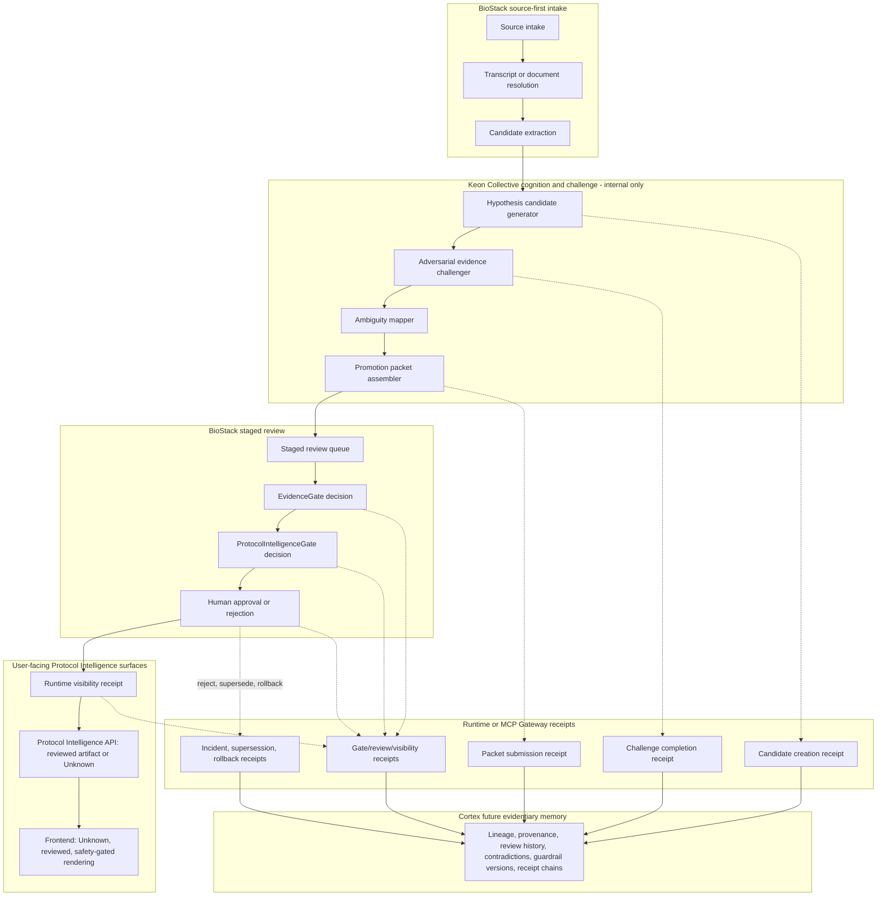

# BioStack Protocol Intelligence and Keon Collective Integration Spike

Date: 2026-06-21  
Status: Integration spike for later implementation planning  
Scope: BioStack Protocol Intelligence candidate generation, challenge, staged review, governance receipts, and future evidentiary memory

## Core Principle

Keon Collective may propose.

BioStack may stage.

EvidenceGate may block.

ProtocolIntelligenceGate may enforce.

Human review may approve.

Runtime or MCP Gateway may receipt effectful promotion.

BioStack user-facing surfaces may only display reviewed, evidence-bound, source-cited, safety-gated artifacts.

Collective must never directly publish protocol guidance to users.

## Non-Goals

This spike does not replace BioStack Protocol Intelligence, alter the current Protocol Intelligence Fruition implementation plan, or move authority from BioStack into Keon Collective. It defines a narrow integration seam where Collective can generate and challenge internal candidate artifacts before BioStack review.

This spike also does not define new biomedical claims, dosing logic, source recommendations, clinical advice, treatment workflows, or user-facing guidance copy.

## Authority Boundary

BioStack remains the authority for reviewed Protocol Intelligence artifacts and all user-facing Protocol Intelligence output. Keon Collective is a non-effecting cognition and challenge layer that can prepare internal candidate material only.

| Capability | Keon Collective | BioStack staged review | EvidenceGate | ProtocolIntelligenceGate | Human reviewer | Runtime or MCP Gateway |
| --- | --- | --- | --- | --- | --- | --- |
| Generate candidate relationships | Allowed, internal only | Receives staged packet | May block later | May enforce later | Reviews when required | Receipts creation/submission |
| Challenge evidence quality | Allowed, internal only | Stores challenge result | May use result | May use result | Reviews unresolved issues | Receipts completion |
| Approve artifact | Forbidden | Tracks pending state | Not approval authority | Not approval authority | Allowed | Receipts decision |
| Publish runtime-visible output | Forbidden | Cannot publish alone | Blocks unsafe evidence | Blocks unsafe protocol intelligence | Approval required | Receipts visibility change |
| Display to user | Forbidden | Forbidden unless approved | Must pass | Must pass | Must approve where required | Runtime serves only approved artifacts |

## Where Keon Collective Participates

Collective may participate only before user-facing runtime visibility and only through internal artifacts with explicit unreviewed status.

1. Source-linked candidate discovery from source material already available to BioStack.
2. Relationship hypothesis generation for review queues.
3. Adversarial evidence challenge before promotion packet submission.
4. Ambiguity mapping for competing explanations behind observed outcomes.
5. Promotion packet assembly for BioStack staged review.
6. Internal rejection, supersession, and archive explanations.
7. Internal evaluation feedback when a candidate, challenge, or packet fails guardrails.

Every Collective output must carry:

- origin: keon_collective
- visibility: internal_only
- reviewStatus: unreviewed
- sourceRefs
- sourceRefsCount
- evidenceTier
- confidence
- forbiddenOutputScan
- highRiskCategoryFlags
- correlationId

## Where Keon Collective Is Forbidden To Participate

Collective must not:

- Create user-facing protocol guidance directly.
- Bypass BioStack staged review.
- Approve, promote, publish, suppress, or rollback BioStack artifacts.
- Override EvidenceGate or ProtocolIntelligenceGate.
- Recommend substance starts, stops, tapers, combinations, escalation, cycles, sourcing, injection, dosing, or substitutions.
- Transform community anecdotes, influencer claims, or market signal into proof.
- Treat investigational peptides, SARMs, SERMs, GLP-1 compounds, gray-market products, or compounded products as safe and effective.
- Create diagnosis, treatment, prevention, cure, prescribing, or medical advice.
- Hide high-risk warnings, regulatory caveats, source-quality uncertainty, or safety notices behind paid tiers.
- Use Cortex memory entries as substitute citations.
- Include sensitive medical protocol text in governance receipts unless explicitly required by a narrowly scoped safety process.

## Integration Roles

### 1. Hypothesis Candidate Generator

Collective may generate unreviewed, non-user-facing candidate relationships from source material. Allowed candidate classes:

- Phase relationship candidates.
- Pathway overlap candidates.
- Contradiction candidates.
- Source-quality uncertainty candidates.
- Side-effect ambiguity candidates.
- Observational correlation candidates.
- Research gap candidates.

Candidate output contract:

| Field | Requirement |
| --- | --- |
| candidateId | Stable internal ID. |
| artifactType | One of the supported Protocol Intelligence artifact families. |
| proposedRelationship | Narrow, observational, non-actionable statement. |
| sourceRefs | Required; empty arrays fail closed. |
| evidenceTier | Existing BioStack tier or Unknown/Insufficient when not reviewable. |
| confidence | Confidence in classification, not confidence that an intervention works. |
| reviewStatus | Always unreviewed at creation. |
| userFacingEligible | Always false until BioStack approval and runtime receipt. |

### 2. Adversarial Evidence Challenger

Collective may challenge each candidate before packet submission. The challenger must ask and record answers to:

- Are citations present and source-linked?
- Is the evidence tier justified by the cited source type?
- Is the relationship overstated beyond the evidence?
- Are regulatory, license, or source-quality caveats missing?
- Are anecdotes or market signals being treated as evidence?
- Are forbidden outputs present?
- Is the claim observational rather than actionable?
- Is the source stale, low quality, commercially biased, or license-restricted?

Challenge output must produce structured reason codes such as:

- missing_source_refs
- tier_overstated
- anecdote_as_evidence
- forbidden_output_match
- regulatory_caveat_missing
- license_boundary_unknown
- observational_boundary_unclear
- source_stale_or_low_quality

### 3. Ambiguity Mapper

Collective may map competing explanations for user-observed outcomes. Output must remain ambiguity-first and must not diagnose causality.

Allowed ambiguity dimensions:

- Timing overlap.
- Multiple recent changes.
- Compound phase.
- Source-quality uncertainty.
- Biomarker ambiguity.
- Adverse-effect overlap.
- Confounding behavior changes.

Allowed framing uses internal labels such as possible_overlap, competing_explanation, source_uncertainty, and needs_review. It must not produce causal certainty or individualized action.

### 4. Promotion Packet Assembler

Collective may assemble a packet for BioStack staged review. The packet remains unapproved until BioStack review, EvidenceGate evaluation, ProtocolIntelligenceGate evaluation, and any required human review are complete.

Minimum packet fields:

- packetId
- artifactType
- proposedRelationship
- sourceRefs
- sourceRefsCount
- evidenceTier
- evidenceTierRationale
- confidence
- confidenceRationale
- reviewRequiredFlags
- forbiddenOutputScan
- blockedOutputMatches
- highRiskCategoryFlags
- userFacingBoundaryDraft
- contradictionNotes
- missingEvidenceNotes
- collectiveChallengeId
- policyVersion
- guardrailVersion
- correlationId

### 5. Rejection and Archive Explainer

Collective may summarize why an artifact was rejected, superseded, archived, or rolled back. These explanations are internal/admin-facing only and should become candidate inputs for future Cortex-backed evidentiary memory.

Allowed explanation fields:

- decisionOutcome
- reasonCodes
- sourceRefsAffected
- priorReviewStatus
- replacementArtifactId
- supersessionReason
- rollbackReason
- guardrailVersion
- reviewerNotesReference

## Artifact Flow Into BioStack Staged Review

Collective does not write directly to runtime artifact stores. It submits internal candidates or promotion packets into BioStack staged review through an integration boundary.

1. Collective candidate artifacts are created as internal-only records.
2. Candidate creation is receipted by MCP Gateway or Runtime.
3. Collective adversarial challenge runs and stores structured reason codes.
4. Challenge completion is receipted.
5. Promotion packet assembler creates a staged packet with candidate plus challenge evidence.
6. Packet submission into BioStack staged review is receipted.
7. BioStack staged review owns the packet state machine from that point forward.
8. EvidenceGate evaluates source presence, evidence tier, citation integrity, source authority, and license boundaries.
9. ProtocolIntelligenceGate evaluates required fields, review status, high-risk flags, user-facing boundary, and forbidden-output scan.
10. Human reviewers approve, reject, or require revision where safety, regulatory, contradiction, source-quality, adverse-effect, prescription, GLP-1, SARM, SERM, peptide, hormone-axis, or high-risk categories are present.
11. Runtime visibility changes only after approved review state and passing gates.

## Required Governance Receipt Points

Receipts should be created by Keon MCP Gateway or Runtime at every effectful boundary. Candidate and challenge events can be receipted by the Gateway integration boundary. Runtime visibility changes, rollback, and user-facing availability changes should be receipted by Runtime.

Required receipt events:

| Event | Receipt owner | Decision authority | Notes |
| --- | --- | --- | --- |
| Candidate artifact creation by Collective | MCP Gateway or Runtime | Collective can create only internal candidates | No user-facing visibility. |
| Adversarial challenge completion | MCP Gateway or Runtime | Collective can complete challenge only | Store reason codes and scan result. |
| Promotion packet submission into BioStack staged review | MCP Gateway | BioStack owns review state after submission | Packet remains unapproved. |
| EvidenceGate decision | Runtime or BioStack gate service | EvidenceGate | Must include blocking reasons. |
| ProtocolIntelligenceGate decision | Runtime or BioStack gate service | ProtocolIntelligenceGate | Must include required-field and forbidden-output results. |
| Human approval or rejection | Runtime or review service | Human reviewer | Required for high-risk and safety-sensitive artifacts. |
| Runtime visibility change | Runtime | Runtime after gates and review | Required before any user-facing Protocol Intelligence API can serve it. |
| Artifact supersession or rollback | Runtime | BioStack reviewer or release process | Must preserve lineage. |
| Forbidden-output incident detection | MCP Gateway or Runtime | Gate or evaluation worker | Must fail closed and preserve evidence for incident review. |
| Evaluation worker safety-critical failure | Runtime or worker service | Evaluation worker blocks release lane | No sensitive protocol text in analytics or receipts. |

Receipt payloads must include:

- actor or agent
- sourceArtifactIds
- sourceRefsCount
- evidenceTier
- confidence
- reviewStatus
- policyVersion
- guardrailVersion
- blockedOutputScanResult
- decisionOutcome
- reasonCodes
- timestamp
- correlationId

Receipts should not include sensitive medical protocol text. Store artifact IDs, source reference counts, classifications, decisions, and hashes where possible.

## Cortex Positioning

Cortex is not the cognition engine. It does not deliberate, swarm, challenge evidence, or decide what BioStack should publish.

Cortex may later serve as evidentiary memory for:

- Artifact lineage.
- Source provenance.
- Review history.
- Contradiction history.
- Supersession events.
- Rollback events.
- Promotion decisions.
- Guardrail versions.
- Receipt chains.
- Why a claim was visible, blocked, archived, rejected, superseded, or replaced.

Collective thinks and challenges. Cortex remembers what can testify. Runtime receipts effects. Gateway enforces boundaries. BioStack displays only reviewed intelligence.

## BioStack Pipeline Mapping

1. Source intake: BioStack ingests source material with source identity, license status, retrieval timestamp, and authority class.
2. Transcript or document resolution: BioStack resolves source documents into source-linked records without treating summaries as proof.
3. Candidate extraction: Existing BioStack extraction identifies possible artifact families and required fields.
4. Collective hypothesis generation: Collective proposes internal candidate relationships with sourceRefs and unreviewed status.
5. Collective adversarial challenge: Collective checks citations, tier rationale, caveats, anecdote boundaries, forbidden outputs, and stale or restricted sources.
6. Promotion packet assembly: Collective prepares a staged packet with proposed relationship, sourceRefs, evidence rationale, confidence rationale, flags, scan result, and contradiction notes.
7. BioStack staged review: BioStack receives the packet as unapproved, internal-only review material.
8. EvidenceGate evaluation: EvidenceGate blocks missing citations, unjustified evidence tier, source mismatch, license uncertainty, stale authority, and unsupported claims.
9. ProtocolIntelligenceGate evaluation: ProtocolIntelligenceGate blocks missing required fields, unapproved status, unsafe user-facing boundary drafts, high-risk gaps, or forbidden-output matches.
10. Human approval: Human reviewers approve, reject, or require revision. High-risk, safety-sensitive, contradiction, regulatory, source-quality, adverse-effect, prescription, hormone-axis, GLP-1, SARM, SERM, and peptide artifacts require human review.
11. Runtime visibility receipt: Runtime creates a visibility-change receipt only after approved review state and passing gates.
12. User-facing Protocol Intelligence API: The API serves reviewed artifacts or Unknown; it does not synthesize new claims from Collective candidates.
13. Frontend Unknown/reviewed/safety-gated rendering: Frontend displays Unknown states, reviewed relationship cards, source-quality warnings, high-risk warnings, and safety notes according to tier entitlements.
14. Telemetry and evaluation feedback: Telemetry measures value without sensitive protocol text. Evaluation workers check citation presence, forbidden-output absence, high-risk warning visibility, and gate behavior.
15. Supersession, archive, or rollback: BioStack preserves lineage, receipts, and admin-only rejection/archive explanations; runtime stops using superseded artifacts for guidance.

## Integration Flow Diagram

## Monetization Impact

This integration strengthens BioStack tiers by making reviewed intelligence deeper without weakening safety boundaries.

### Observer

- Safer Unknown states when only unreviewed Collective candidates exist.
- Visible high-risk warnings and source-quality caveats.
- Trust-building contract transparency: users can see that BioStack distinguishes unreviewed hypotheses from reviewed evidence.
- Safety warnings remain visible; they are not paid-tier features.

### Operator

- Reviewed relationships with evidence tier, confidence, sourceRefs count, and review status.
- Source-quality tracker for identity, label, regulatory, and license uncertainty.
- Phase map for interpreting timeline context without implying instructions.
- Evidence cards that show reviewed relationships and contradiction notes.

### Commander

- Side-effect ambiguity review framed as competing explanations, not diagnosis.
- Longitudinal Protocol Intelligence summaries from reviewed artifacts.
- Report-ready observational packets for discussion and review.
- Deeper correlation panels that keep source, evidence, review, and uncertainty visible.
- Review-ready intelligence history.

Commander does not provide medical advice. It provides deeper reviewed intelligence, ambiguity analysis, and report-ready observational summaries.

## Telemetry That Proves Value

Telemetry must not log sensitive protocol text, medical details, source excerpts, or user-entered treatment narratives. Use artifact IDs, counts, reason codes, and tier-safe event metadata.

Recommended events:

| Event | Purpose | Safe properties |
| --- | --- | --- |
| collective_candidate_created | Measures candidate throughput | artifactType, sourceRefsCount, evidenceTier, confidence, highRiskCategoryFlags, correlationId |
| collective_challenge_completed | Measures challenge coverage | reasonCodes, blockedOutputScanResult, challengeDurationMs, correlationId |
| promotion_packet_submitted | Measures review queue flow | artifactType, sourceRefsCount, reviewRequiredFlags, correlationId |
| evidence_gate_blocked | Measures evidence quality gaps | reasonCodes, evidenceTier, sourceRefsCount, policyVersion |
| protocol_intelligence_gate_blocked | Measures safety and contract gaps | missingFieldsCount, blockedOutputMatchesCount, guardrailVersion |
| human_review_decision_recorded | Measures review outcomes | decisionOutcome, reasonCodes, artifactType, highRiskCategoryFlags |
| runtime_visibility_changed | Measures approved artifact activation | artifactType, reviewStatus, evidenceTier, guardrailVersion |
| protocol_intelligence_unknown_state_viewed | Measures safe fallback frequency | tier, artifactType, missingReviewedArtifactReason |
| reviewed_relationship_viewed | Measures Operator value | tier, relationshipType, evidenceTier, sourceRefsCount |
| side_effect_ambiguity_panel_viewed | Measures Commander value | tier, ambiguityDimensionsCount, sourceRefsCount |
| high_risk_warning_viewed | Confirms warning visibility | tier, highRiskCategoryFlags, warningVersion |

Value proof should focus on:

- More review-ready packets per source intake.
- Higher rejection quality through explicit reason codes.
- Lower unsafe-output incidence after adversarial challenge.
- Faster reviewer decisions due to packet completeness.
- Higher Operator engagement with reviewed relationship and source-quality panels.
- Higher Commander engagement with ambiguity and longitudinal review panels.
- Unknown states decreasing only when reviewed artifacts increase.

## Future Tests and Contract Checks

Add tests later for:

1. Collective output cannot become user-facing without BioStack review.
2. Candidate packets without sourceRefs are blocked.
3. Collective-generated text containing forbidden phrases is blocked.
4. Adversarial challenge must run before promotion packet submission.
5. Runtime receipt exists for promotion visibility change.
6. Cortex memory entries cannot replace sourceRefs.
7. Unknown state is returned when only unreviewed Collective candidates exist.
8. High-risk warnings remain visible to all tiers.
9. Rejected artifacts stay internal/admin-only.
10. Superseded artifacts are not used for runtime guidance.
11. EvidenceGate receipt includes sourceRefs count, evidence tier, outcome, reason codes, and correlation ID.
12. ProtocolIntelligenceGate receipt includes required-field status, review status, forbidden-output scan, policy version, and guardrail version.
13. Evaluation worker safety-critical failure blocks release or promotion.
14. Runtime API never reads directly from Collective candidate stores.
15. Promotion packet submission fails when challenge result is missing, stale, or from a different correlation ID.
16. Paid-tier gates cannot suppress safety warnings, regulatory caveats, or high-risk notices.
17. Rejection and archive explanations are internal/admin-only and excluded from user-facing APIs.
18. Receipt payloads do not include sensitive medical protocol text.

## Implementation Notes For Later Agents

- Keep this integration behind an internal candidate store or staged-review import boundary.
- Treat Collective outputs as review inputs, not product truth.
- Use BioStack's existing evidence tier, confidence, sourceRefs, review status, high-risk category, and forbidden-output vocabulary.
- Do not route user requests directly to Collective for Protocol Intelligence answers.
- Prefer deterministic gate checks over model judgment for promotion eligibility.
- Preserve source-first behavior: sourceRefs are required, Cortex memory is supplemental, and receipts are evidence of process rather than evidence of biomedical truth.
- Runtime visibility is the effectful boundary and must be receipted.
